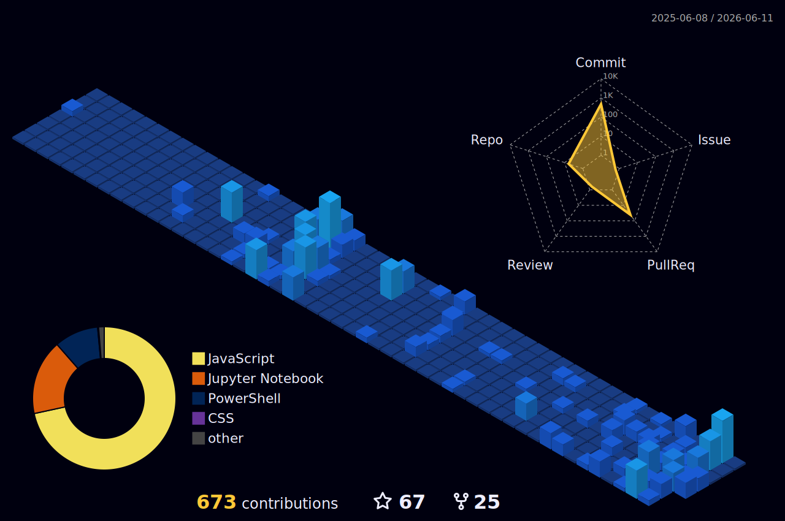

<!-- ═══════════════════════════════════════════════════════════════ -->
<!-- NGUYỄN NGỌC ANH TÚ · CYBERSECURITY · DFIR · DETECTION       -->
<!-- ═══════════════════════════════════════════════════════════════ -->

  

 

<!-- ─── DYNAMIC HACKER TERMINAL ─────────────────────────────────── -->

  

 

<!-- ─── SECTION: ABOUT ──────────────────────────────────────────── -->

  

 

  

<!-- ─── SECTION: CAPABILITY MAP ─────────────────────────────────── -->

  

<!-- ─── SECTION: ARSENAL ────────────────────────────────────────── -->

  

 

<!-- ─── TECH STACK BADGES (black + champagne gold) ──────────────── -->

  
  
  
  
  
  

    

  
  
  
  
  
  

 

<!-- ─── SECTION: TIMELINE ───────────────────────────────────────── -->

  

<!-- ─── SECTION: METRICS ────────────────────────────────────────── -->

  

 

  

 

  
  

 

  

 

<!-- ─── 3D CONTRIBUTION GRAPH ─────────────────────────────────────── -->

  

 

<!-- ─── CYBER SNAKE ───────────────────────────────────────────────── -->

  <picture>
    <source media="(prefers-color-scheme: dark)" srcset="dist/github-snake-dark.svg">
    <source media="(prefers-color-scheme: light)" srcset="dist/github-snake-dark.svg">
    
  </picture>

 

<!-- ─── SECTION: CONNECT ────────────────────────────────────────── -->

  

 

  
  
    

  
  
  
  

    

  

 

<!-- ─── FOOTER ──────────────────────────────────────────────────── -->

  

