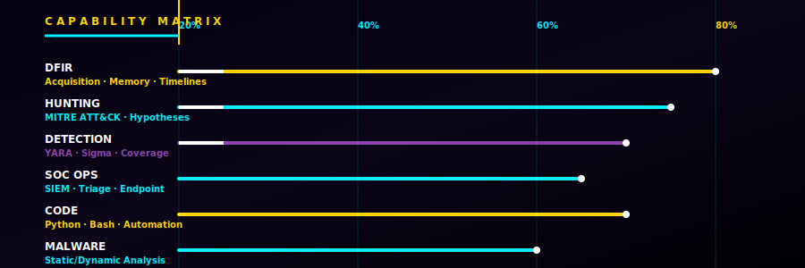

<!-- ═══════════════════════════════════════════════════════════════ -->
<!-- NGUYỄN NGỌC ANH TÚ · CYBERSECURITY · DFIR · DETECTION       -->
<!-- ═══════════════════════════════════════════════════════════════ -->

 

<!-- ─── SECTION: ABOUT ──────────────────────────────────────────── -->

 

<!-- ─── SECTION: CAPABILITY MAP ─────────────────────────────────── -->

<!-- ─── SECTION: TIMELINE ───────────────────────────────────────── -->

<!-- ─── SECTION: METRICS ────────────────────────────────────────────── -->

  

&nbsp;&nbsp;

  

<!-- ─── SECTION: CONNECT ────────────────────────────────────────── -->

 

 

 

<!-- ─── FOOTER ──────────────────────────────────────────────────── -->

